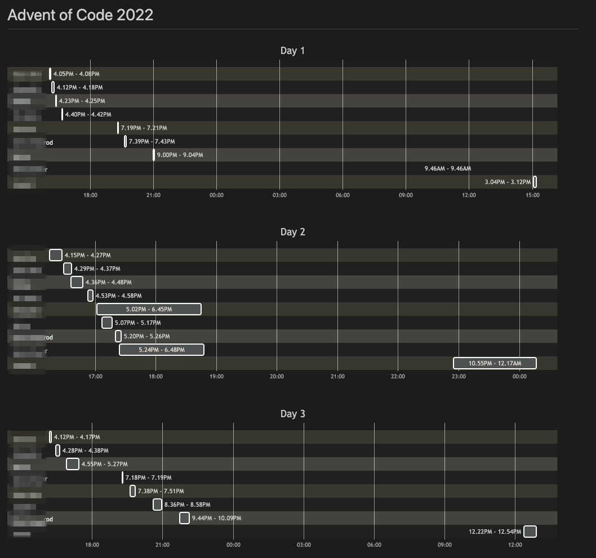

# Advent of code 2022

just going for quick wins.

run `bun day 1`, `bun day 2`, etc.

## Timeline

Copy your website session cookie to `cookie.txt` (the file contain a single line that looks like `session=xxxxx`)

Edit the URL you want to load data from in `src/util.ts` `fetchTimeline` method to match your own private scoreboard,
then run `bun timeline` then look at the generated `timeline.md`. Data is cached in `timeline.json` - so delete that and run again whenever you want to refresh.

I recommend https://marketplace.visualstudio.com/items?itemName=bierner.markdown-mermaid for viewing easily within vscode.
I might automate pushing the result of this to github... but probably shouldn't do that to a public repo.

